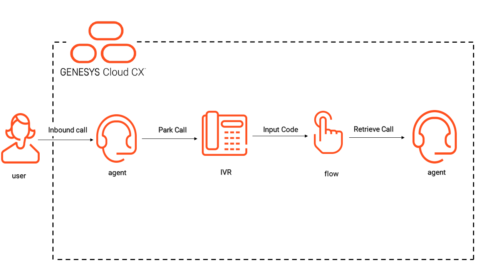

# Park an active voice call with a code and retrieve it using the code

This Genesys Cloud Developer Blueprint explains how to set up Genesys Cloud to park an active voice call with a code and retrieve it using the code.

When an Genesys Cloud user transfers an active call to an in-queue flow with a code, the call can be retrieved from another phone, station or user using the code associated with that call.

The following illustration shows the end-to-end user experience that this solution enables.

