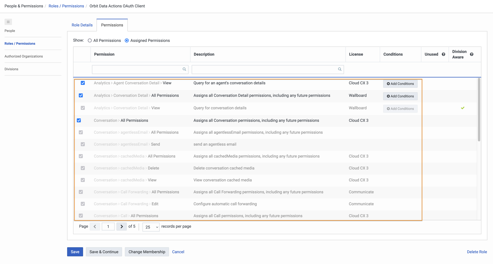
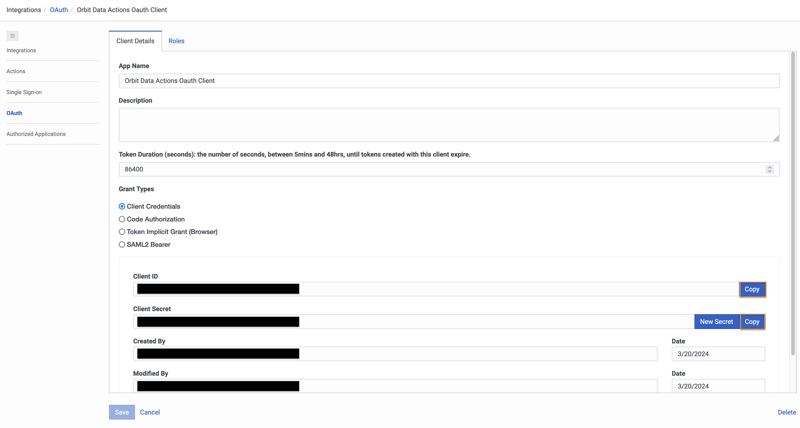

This Genesys Cloud Developer Blueprint explains how to set up Genesys Cloud to park an active voice call with a code and retrieve it using the code.

When an Genesys Cloud user transfers an active call to an in-queue flow with a code, the call can be retrieved from another phone, station or user using the code associated with that call.

The following illustration shows the end-to-end user experience that this solution enables.

## Solution components

* **Genesys Cloud** - A suite of Genesys cloud services for enterprise-grade communications, collaboration, and contact center management. Contact center agents use the Genesys Cloud user interface.
* **Genesys Cloud API** - A set of RESTful APIs that enables you to extend and customize your Genesys Cloud environment.

## Prerequisites

### Specialized knowledge

* Administrator-level knowledge of Genesys Cloud

### Genesys Cloud account

* A Genesys Cloud CX 1 license. For more information, see [Genesys Cloud Pricing](https://www.genesys.com/pricing "Opens the Genesys Cloud pricing article").
* The Master Admin role in Genesys Cloud. For more information, see [Roles and permissions overview](https://help.mypurecloud.com/?p=24360 "Opens the Roles and permissions overview article") in the Genesys Cloud Resource Center.

## Configure Genesys Cloud

### Create custom roles for use with Genesys Cloud OAuth clients

Create a custom role for use with a Genesys Cloud OAuth client with the following permissions.

| Roles           | Permissions | Role Name |
|-----------------|-------------------------|---------|
| Custom role 1 | **Conversation** > **All Permissions**, **Analytics** > **Conversation Detail** > **All Permissions**, **Analytics** > **Agent Conversation Detail** > **View**   | Orbit Data Actions OAuth Client |

To create a custom role in Genesys Cloud:

1. Navigate to **Admin** > **Roles/Permissions** and click **Add Role**.

   

2. Enter the **Name** for your custom role.

    

3. Search and select the required permission for each of the custom role.
   
4. Click **Save** to assign the appropriate permission to your custom role.

:::primary
  **Note:** Assign this custom role to your user before creating the Genesys Cloud OAuth client.
  :::

### Create an OAuth client for use with a Genesys Cloud data action integration

To enable a Genesys Cloud data action to make public API requests on behalf of your Genesys Cloud organization, use an OAuth client to configure authentication with Genesys Cloud.

Create an OAuth client for use with the data action integration with the following custom roles.

| OAuth Client   | Custom role | OAuth Client Name |
|----------------|-------------------------------|-------|
| OAuth Client 1 | Orbit Data Actions OAuth Client | Orbit Data Actions OAuth Client |

To create an OAuth Client in Genesys Cloud:

1. Navigate to **Admin** > **Integrations** > **OAuth** and click **Add Client**.

   

2. Enter the name for the OAuth client and select **Client Credentials** as the grant type. Click the **Roles** tab and assign the required role for the OAuth client.

     

3. Click **Save**. Copy the client ID and the client secret values for later use.

   

:::primary
  **Note:** Ensure that you copy the client ID and client secret values for each of the OAuth clients.
  :::

### Add Genesys Cloud data action integration

Add a Genesys cloud data action integration for each OAuth client being used with this blueprint to call the Genesys Cloud public API to:
* Get Waiting Calls in specific Queue based on External Tag
* Replace participant with ANI
* Update External Tag on Conversation

To create a data action integration in Genesys Cloud:

1. Navigate to **Admin** > **Integrations** > **Integrations** and install the **Genesys Cloud Data Actions** integration. For more information, see [About the data actions integrations](https://help.mypurecloud.com/?p=209478 "Opens the About the data actions integrations article") in the Genesys Cloud Resource Center.

   

2. Enter a name for the Genesys Cloud data action, such as Orbit Data Actions OAuth Integration in this blueprint solution.

   

3. On the **Configuration** tab, click **Credentials** and then click **Configure**.

   

4. Enter the client ID and client secret that you saved for the Presence Public API [(OAuth Client 1)](#create-oauth-clients-for-use-with-genesys-cloud-data-action-integrations "Goes to the create an OAuth Client section"). Click **OK** and save the data action.

   

5. Navigate to the Integrations page and set the presence data action integration to **Active**.

   

### Import the Genesys Cloud data actions

Import the following JSON files from the [genesys-cloud-call-park repo](https://github.com/GenesysCloudBlueprints/genesys-cloud-call-park) GitHub repository:
* `Get-Waiting-Calls-in-specific-Queue-based-on-External-Tag.custom.json`
* `Replace-participant-with-ANI.custom.json`
* `Update-External-Tag-on-Conversation.custom.json`

Import each of data action files and associate with the Orbit Data Actions Oauth Integration data action integration, which uses the Orbit Data Actions OAuth Client.

1. From the [genesys-cloud-call-park repo](https://github.com/GenesysCloudBlueprints/genesys-cloud-call-park) GitHub repository, download the `Get-Waiting-Calls-in-specific-Queue-based-on-External-Tag.custom.json` file.

2. In Genesys Cloud, navigate to **Integrations** > **Actions** and click **Import**.

   

3. Select the `Get-Waiting-Calls-in-specific-Queue-based-on-External-Tag.custom.json` file and associate with the [Orbit Data Actions Oauth Integration](#add-genesys-cloud-data-action-integrations "Goes to the Add Genesys Cloud data action integrations section") integration, and then click **Import Action**.

   

4. From the [genesys-cloud-call-park repo](https://github.com/GenesysCloudBlueprints/genesys-cloud-call-park) GitHub repository, download the `Replace-participant-with-ANI.custom.json` file.

5. In Genesys Cloud, navigate to **Integrations** > **Actions** and click **Import**.

   

6. Select the `Replace-participant-with-ANI.custom.json` file and associate with the [Orbit Data Actions Oauth Integration](#add-genesys-cloud-data-action-integrations "Goes to the Add Genesys Cloud data action integrations section") integration, and then click **Import Action**.

   

7. From the [genesys-cloud-call-park repo](https://github.com/GenesysCloudBlueprints/genesys-cloud-call-park) GitHub repository, download the `Update-External-Tag-on-Conversation.custom.json` file.

8. In Genesys Cloud, navigate to **Integrations** > **Actions** and click **Import**.

  

9. Select the `Update-External-Tag-on-Conversation.custom.json` file and associate with the [Orbit Data Actions Oauth Integration](#add-genesys-cloud-data-action-integrations "Goes to the Add Genesys Cloud data action integrations section") integration, and then click **Import Action**.

  

### Import the Architect workflows

This solution includes two Architect flows.

* The first is an inbound call flow.  The **Orbit - Parked Call Retrieval.i3InboundFlow** flow allows the parked call to be retrieved with the code stored on the External Tag on the conversation record.  It uses the two of the [data actions](#add-genesys-cloud-data-action-integrations "Goes to the Add a web services data actions integration section").

* The second is an in-queue call flow.  The **InQueue - Orbit Call Park Hold.i3InQueueFlow** flow plays hold music for the customer has the parked call is waiting to be retrieved.

First import this workflow to your Genesys Cloud organization:

1. Download the `InQueue - Orbit Call Park Hold.i3InQueueFlow` file from the [genesys-cloud-call-park repo](https://github.com/GenesysCloudBlueprints/genesys-cloud-call-park) GitHub repository.

2. In Genesys Cloud, navigate to **Admin** > **Architect** > **Flows:In-Queue Call** and click **Add**.

   

3. Enter a name for the workflow and click **Create Flow**.

   

4. From the **Save** menu, click **Import**.

   

5. Select the downloaded **Terminate Outbound Call Missing Queue.i3WorkFlow** file and click **Import**.

6. Review your workflow. Click **Save** and then click **Publish**.

7. Download the `Orbit - Parked Call Retrieval.i3InboundFlow` file from the [genesys-cloud-call-park repo](https://github.com/GenesysCloudBlueprints/genesys-cloud-call-park) GitHub repository.

8. In Genesys Cloud, navigate to **Admin** > **Architect** > **Flows:Inbound call** and click **Add**.

   

9. Enter a name for the workflow and click **Create Flow**.

   

10. From the **Save** menu, click **Import**.

   

11. Select the downloaded **Terminate Outbound Call Missing Queue.i3WorkFlow** file and click **Import**.

12. Review your workflow. Map the Data Actions referenced in the flow to the Data Actions with the corresponding names you imported earlier in this blueprint.  For the **Get Waiting Calls in specific Queue based on External Tag** action, make sure the value in the **holdingQueueId** parameter matches the id of the queueyour **InQueue - Orbit Call Park Hold** in-queue call flow. Click **Save** and then click **Publish**.

## Import the Script

Create the trigger that invokes the created Architect workflow.

1. From Admin Home, search for **Triggers** and navigate to the Triggers list.

   

2. From the Triggers list, click **Add Trigger**

   

3. From the Add New Trigger modal, name your trigger and click **Add**

   

4. From the Trigger single view, in the **Topic Name** menu, select **v2.detail.events.conversation.{id}.user.start**.  In the **Workflow Target** menu, select **Terminate Outbound Call Missing Queue**.  Leave **Data Format** as **TopLevelPrimitives**.  Click **Add Condition**.  For more information, see [Available Topics](https://developer.genesys.cloud/notificationsalerts/notifications/available-topics "Opens the Available Topics article") in the Genesys Cloud Developer Center.  Using the notification monitoring tool in the Developer Center, you can watch the notifications happen.

  

5. From the Trigger single view, in the **JSON Path** field, type **queueId**.  In the **Operator** menu, select **Exists**.  Set the **Value** toggle to **False**.  Click **Create**.

      

      :::primary Note: If you are interested in allowing PBX calls to other GC users, adding the following criteria to your trigger may allow you to use the simpler `Terminate Outbound Call Missing Queue.i3WorkFlow` file for your Architect workflow.  This will reduce the amount of time between the trigger firing and the call being disconnected.  You can adjust the string in the contains condition to match your business needs.  Especially if your agents are calling specific country codes. :::

      

6. From the Trigger single view, set the **Active** toggle to **Active**.  Click **Save**.

     

## Additional resources

* [Genesys Cloud API Explorer](https://developer.genesys.cloud/devapps/api-explorer "Opens the GC API Explorer") in the Genesys Cloud Developer Center
* [Genesys Cloud notification triggers](https://developer.genesys.cloud/notificationsalerts/notifications/available-topics "Opens the Available topics page") in the Genesys Cloud Developer Center
* The [terminate-voice-calls-with-no-queue repo](https://github.com/GenesysCloudBlueprints/terminate-voice-calls-with-no-queue) repository in GitHub
